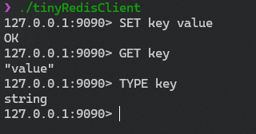

## 介绍

本项目是Linux上基于C++和io_uring的轻量级Redis

## 数据结构

使用跳表作为核心数据结构，支持Redis的五种数据类型：字符串，哈希，列表，集合，有序集合

## 命令

支持Redis的五种数据类型的基本操作命令，基于读写锁保证命令的原子性，支持事务的执行和撤销

## 数据持久化

实现了基于RDB和AOF的混合持久化，每秒钟会将数据异步写入AOF文件，会根据时间间隔和写入次数决定是否执行RDB，提供了数据安全和更快的数据恢复速度。

## io_uring

利用io_uring实现了高性能的异步IO，支持多个IO操作的批量提交，减少系统调用次数，提高性能

## 日志

利用io_uring的异步IO和linux O_APPEND特性实现了异步且线程安全的高性能日志系统，支持多种日志级别和提供详细的日志信息

## 协程

包装C++20协程的coroutine，实现了Awaiter和Task，简化异步编程

## 调度器

基于协程实现了一个简单的调度器，支持协程的创建、销毁、挂起和唤醒，程序会根据CPU核心数创建相应数量的调度器，每个调度器互相独立，互不干扰

## 信号处理

自动处理SIGTERM和SIGINT信号，释放所有资源后优雅地关闭服务器

## 环境

GCC14及以上，CMake，Ninja，liburing2.7及以上

## 编译

```shell 
cmake -B build -G Ninja -DCMAKE_BUILD_TYPE=Release
cd build
ninja
```

## 运行

服务端

```shell
cd build/tinyRedis/tinyRedisServer
./tinyRedisServer
```

客户端

```shell
cd build/tinyRedis/tinyRedisClient
./tinyRedisClient
```

## 演示


